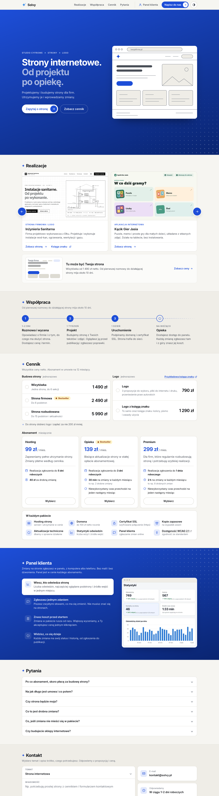

	

# Solvy: strona firmowa

Strona studia Solvy. Projektujemy i budujemy strony internetowe dla małych firm, a potem je utrzymujemy i wprowadzamy zmiany w stałym abonamencie.

**Podgląd strony:** https://dmindabrowski.github.io/solvy-www/

To wersja robocza do oglądania i uwag. Docelowo strona będzie działać pod adresem solvy.pl, a część danych jest jeszcze tymczasowa (lista niżej).

## Co jest na stronie

Jedna strona, która prowadzi od oferty do zapytania. Działa na telefonie i komputerze, w trybie jasnym i ciemnym.

- **Góra strony:** hasło „Strony internetowe." z drugim zdaniem, które zmienia się co kilka sekund, i dwa przyciski: do zapytania i do cennika.
- **Realizacje:** wykonane projekty w rzędzie, który przesuwa się strzałkami albo palcem. Każdy ma link do strony, a pierwszy także do księgi znaku.
- **Współpraca:** cztery etapy, od rozmowy i wyceny do opieki nad gotową stroną. Od pierwszej rozmowy do działającej strony mija około 10 dni.
- **Cennik:** budowa strony, logo i abonament. Każdą pozycję można zaznaczyć, a pasek u dołu ekranu sumuje wybór i pozwala od razu wysłać zapytanie.
- **Panel klienta:** cztery zrzuty z panelu, w którym klient zgłasza zmiany i widzi ich postęp.
- **Pytania:** sześć najczęstszych pytań o abonament, umowę i zmiany. Każde ma własny adres, więc można wysłać link do jednej odpowiedzi.
- **Kontakt:** krótki formularz z wyborem tematu, który otwiera gotową wiadomość e-mail, a obok adres e-mail i numer telefonu.

## Oferta w skrócie

Wszystkie ceny netto. Abonament w umowie na 12 miesięcy.

| Budowa strony | Zakres | Cena |
| --- | --- | --- |
| Wizytówka | jedna strona, do 6 sekcji | 1 490 zł |
| Strona firmowa | do 6 podstron | 2 490 zł |
| Strona rozbudowana | do 15 podstron i aktualności | 5 990 zł |

| Logo | Zakres | Cena |
| --- | --- | --- |
| Logo | 3 propozycje do wyboru, pliki do internetu i druku, przeniesienie praw autorskich | 790 zł |
| Logo z księgą znaku | to samo oraz księga znaku: kolory, pismo i zasady użycia | 1 290 zł |

Logo zamówione razem ze stroną jest o 200 zł tańsze.

| Abonament | Czas na zmiany | Termin realizacji zgłoszenia | Cena za miesiąc |
| --- | --- | --- | --- |
| Hosting | zmiany płatne według cennika | do 5 dni roboczych | 99 zł |
| Opieka | 30 min w każdym miesiącu | do 3 dni roboczych | 139 zł |
| Premium | 2 h w każdym miesiącu | do 1 dnia roboczego | 299 zł |

W każdym pakiecie: hosting strony, domena do 100 zł netto rocznie, certyfikat SSL, kopie zapasowe, aktualizacje techniczne, statystyki odwiedzin, panel klienta i zgodność ze standardem dostępności WCAG 2.1.

Ceny i teksty strony są zebrane w jednym pliku: [`src/data/oferta.json`](src/data/oferta.json). Zmiana ceny w tym pliku zmienia ją w każdym miejscu strony.

## Co zostało do zrobienia

Zanim strona trafi pod adres solvy.pl:

- [ ] **Serwer i domena.** Strona działa na razie tylko jako podgląd pod adresem powyżej.
- [ ] **NIP w stopce.** Obecny numer jest tymczasowy.
- [ ] **Wysyłka z formularza.** Formularz kontaktowy i pasek z sumą otwierają dziś program pocztowy z gotową wiadomością. Docelowo zapytanie ma wychodzić prosto ze strony.
- [ ] **Link do panelu klienta.** Prowadzi do adresu panel.solvy.pl, który zacznie działać razem z panelem.
- [ ] **Adres realizacji Inżynieria Sanitarna.** Karta linkuje do podglądu strony; po uruchomieniu domeny klienta trzeba go podmienić.
- [ ] **Obrazek do udostępniania.** Ten, który pokazuje się po wklejeniu linku w komunikatorze, ma jeszcze poprzednie hasło.
- [ ] **Strona błędu.** Brakuje strony dla nieistniejącego adresu.

## Powiązane projekty

- **Panel klienta** powstaje w osobnym, prywatnym repozytorium. Jak wygląda, pokazuje sekcja [Panel klienta](https://dmindabrowski.github.io/solvy-www/#panel) na podglądzie strony.
- **Inżynieria Sanitarna Karol Kozicki**, pierwsza realizacja ze stroną i logo: [repozytorium](https://github.com/dmindabrowski/instalacje-sanitarne-karol-kozicki) i [podgląd strony](https://dmindabrowski.github.io/instalacje-sanitarne-karol-kozicki/).
